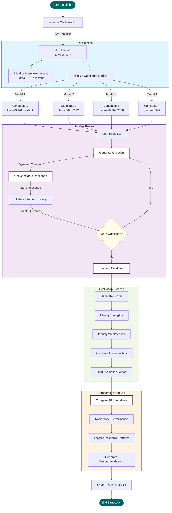
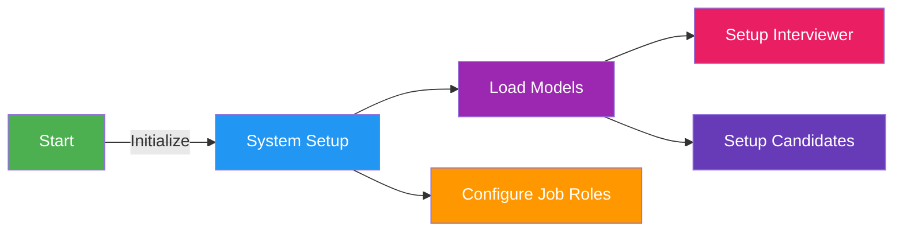
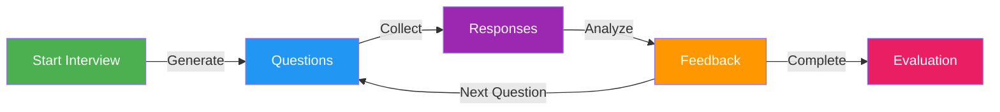
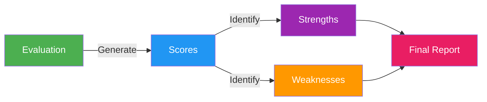

# LLM Interview Simulator (Agentic Simulation)

A fascinating experiment to evaluate how different Large Language Models (LLMs) perform in simulated job interviews. This project creates a controlled environment where multiple LLM models play the role of job candidates while being interviewed by a consistent interviewer model.


## 📋 Table of Contents
- [Process Flow](#-process-flow)
- [Project Overview](#-project-overview)
- [Models Used](#-models-used)
- [Installation](#-installation)
- [Usage](#-usage)
- [Features](#-features)
- [Project Structure](#-project-structure)
- [Sample Output](#-sample-output)
- [Contributing](#-contributing)
- [License](#-license)
- [Acknowledgments](#-acknowledgments)


## 🔄 Process Flow

### Overall Flow



### 1. System Setup Flow


### 2. Interview Process Flow


### 3. Evaluation Flow


## 🎯 Project Overview

This project simulates job interviews using different LLM models as candidates, while maintaining a consistent interviewer (Co-founder/CEO) model. The simulation:

- 📝 Conducts structured interviews for various job positions
- 🤖 Uses different LLM models to simulate candidate responses
- 📊 Provides comprehensive evaluation and feedback
- 📈 Generates comparative analysis across different models
- 💡 Offers practical interview improvement suggestions

## 🤖 Models Used

### Interviewer
```python
Model: groq/llama-3.1-8b-instant
Role: Co-founder and CEO
Purpose: Consistent evaluation across all interviews
```

### Candidates
| Model |
|-------|
| groq/llama-3.1-8b-instant |
| groq/llama3-8b-8192 |
| groq/mixtral-8x7b-32768 |
| gemma-7b-it |

## 🔧 Installation

1. **Clone the repository:**
```bash
git clone https://github.com/yourusername/llm-interview-simulator.git
cd llm-interview-simulator
```

2. **Create and activate virtual environment:**
```bash
python -m venv venv
source venv/bin/activate  # On Windows: venv\Scripts\activate
```

3. **Install dependencies:**
```bash
pip install -r requirements.txt
```

4. **Set up environment variables:**
```bash
echo "GROQ_API_KEY=your_api_key_here" > .env
```

## 💻 Usage

1. **Run the simulation:**
```bash
python main.py
```

2. **Choose a job title:**
```python
job_titles = [
    "Marketing Associate",
    "Business Development Representative",
    "Product Manager",
    "Customer Success Representative",
    "Data Analyst",
    "AI Engineer"
]
```

## 📊 Features

### Interview Process
- 🔄 Dynamic question generation
- 💬 Natural conversation flow
- 🎯 Technical skill assessment
- 🤝 Cultural fit evaluation

### Evaluation Metrics
| Metric | Description |
|--------|-------------|
| Decision | Pass/Fail outcome |
| Score | 0-100 numerical rating |
| Strengths | Key positive attributes |
| Improvements | Areas for development |
| Tips | Interview improvement suggestions |
| Reasoning | Detailed evaluation logic |

## 📁 Project Structure

```
llm-interview-simulator/
├── 📄 agents.py           # Agent definitions
├── 📄 tasks.py           # Interview tasks
├── 📄 interview_simulation.py  # Core logic
├── 📄 main.py           # Entry point
├── 📄 requirements.txt  # Dependencies
└── 📄 README.md        # Documentation
```


### Output Format
```json
{
    "job_title": "AI Engineer",
    "interview_date": "2024-03-31 14:30:22",
    "candidates": {
        "candidate1": {
            "model": "groq/llama-3.1-8b-instant",
            "score": 85,
            "evaluation": "..."
        }
    },
    "comparative_analysis": "..."
}
```

## 🤝 Contributing

We welcome contributions! Areas for improvement:
- 📝 New job positions
- 🤖 Additional LLM models
- 📊 Enhanced metrics
- 💡 Feature additions

## 📝 License

This project is licensed under the MIT License - see the LICENSE file for details.

## 🙏 Acknowledgments

- 🛠️ Built with CrewAI framework
- 🤖 Powered by Groq's LLM models
- 💼 Inspired by real-world interviews

## ⚠️ Disclaimer

This is an experimental project for research and educational purposes. The simulations should not be used as the sole basis for actual hiring decisions.


Key metrics displayed:
- ⭐ Response quality scores
- 🤝 Cultural fit assessment
- 🧠 Technical knowledge evaluation
- 💬 Communication style analysis

---
Made with ❤️ by KT
